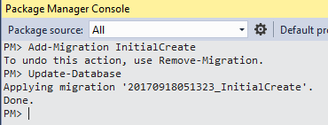

# ASP.NET Core 2.0 WebAPI integrated with Auth0

This seed project has been created to assist in setting up a new ASP .Net Core 2.0 WebAPI project. The following features have been implemented as part of this guide:

- initial project structure created from dotnet cli webapi template
- integration to accept authentication from Auth0 using JWT tokens
- integration to a SQL database using Entity Framework Core 2.0
- example of anonymous and authorized endpoints
- setup of Mediatr library
- guide to setup VSTS build/deploy pipeline with DB Migrations

The following sections describe 'how' this solution was created. If you intend on using it, simply clone the repo, updating your namespace and insert your Auth0 credentials and off you go!

## Initial Setup

* This can be performed using the dotnet-cli commands, however, it was simply easier given I have the Visual Studio template which has the added bonus of setting up the Solution file too!

  
  
  

* Add the following NuGet packages:
  - MediatR
  - MediatR.Extensions.Microsoft.DependencyInjection
  - Microsoft.EntityFrameworkCore
  - Microsoft.EntityFrameworkCore.SqlServer
  - Microsoft.EntityFrameworkCore.Tools.DotNet
  
## Setting up EntityFramework and Database

* Add a **ConnectionString node** to **appsettings.json**


* Create an object to represent an Application User

```cs
using System.ComponentModel.DataAnnotations.Schema;

namespace auth0api.Users
{
    public class ApplicationUser
    {
        [DatabaseGenerated(DatabaseGeneratedOption.Identity)]
        public int Id { get; set; }
        public string ExternalId { get; set; }
        public string Username { get; set; }
        public string FirstName { get; set; }
        public string LastName { get; set; }
        public string Email { get; set; }
    }
}
```

* Create a database context object

```cs
using auth0api.Users;
using Microsoft.EntityFrameworkCore;

namespace auth0api.Data
{
    public class ApplicationDbContext : DbContext
    {
        public ApplicationDbContext(DbContextOptions<ApplicationDbContext> options) : base(options)
        {
        }

        public DbSet<ApplicationUser> Users { get; set; }
    }
}

```

* Update **Startup.cs::ConfigureServices()** method

```cs
services.AddDbContext<ApplicationDbContext>(options => options.UseSqlServer(Configuration.GetConnectionString("DefaultConnection")));
```

### Setting up Database Migrations

The following section describes how to setup database migrations to allow you to keep track of the state of your database schema along with your code. These instructions are based off this 

* Launch **Package Manager Console**

* Execute the command `Add-Migration InitialCreate`

* Update the database with the following command `Update-Database`



## Setting up Auth0 and JWT Authentication

* Add your Auth0 Credentials from the portal into the appsettings.json file.

```json
  "Auth0": {
    "Domain": "<insert Auth0 domain>",
    "ApiIdentifier": "<insert Auth0 api identifier>"
  }
```

* Update Startup.cs::ConfigureServices() method to accept JWT tokens with the above configuration

```cs
services.AddAuthentication(options =>
{
    options.DefaultAuthenticateScheme = JwtBearerDefaults.AuthenticationScheme;
    options.DefaultChallengeScheme = JwtBearerDefaults.AuthenticationScheme;

}).AddJwtBearer(options =>
{
    options.Authority = domain;
    options.Audience = Configuration["Auth0:ApiIdentifier"];
    options.SaveToken = true;
});
```

* Ensure that your application is configured to use Authentication, Startup.cs::Configure() method

```cs
app.UseAuthentication();
```

### Example of and anonymous endpoint vs authorized endpoint

```cs
using Microsoft.AspNetCore.Authorization;
using Microsoft.AspNetCore.Mvc;

namespace auth0api.Controllers
{
    [Route("api")]
    public class PingController : Controller
    {
        [HttpGet]
        [Route("ping")]
        public JsonResult Ping()
        {
            return new JsonResult("Pong");
        }

        [Authorize]
        [HttpGet]
        [Route("ping/secure")]
        public JsonResult PingSecured()
        {
            return new JsonResult("All good. You only get this message if you are authenticated.");
        }
    }
}
```

## Setting up MediatR (Recommended)

In our quest to keep our code maintainable and decoupled as much as we can, we have adopted the use of the Command Query Responsibility Segregation (CQRS) and Mediator pattern via the use of a library called MediatR. For a more in depth read of why we have found this library useful, please see 

* Add the MediatoR extension to Startup.cs::ConfigureServices() method

```cs
services.AddMediatR();
```
